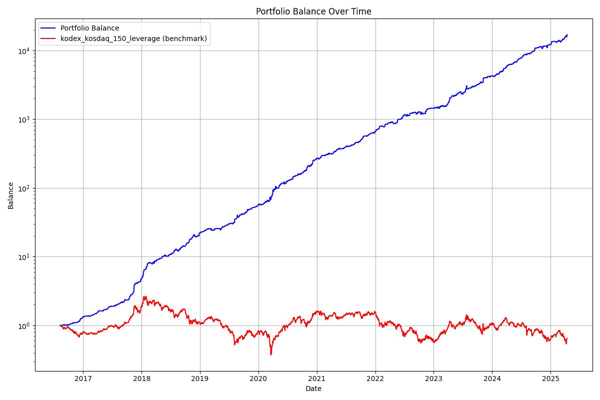
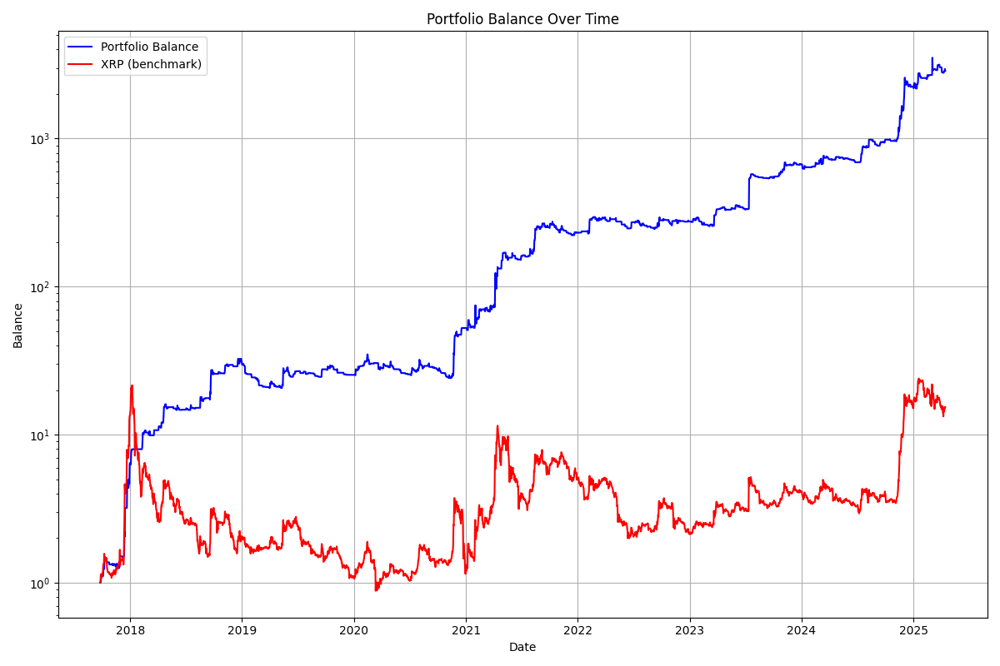
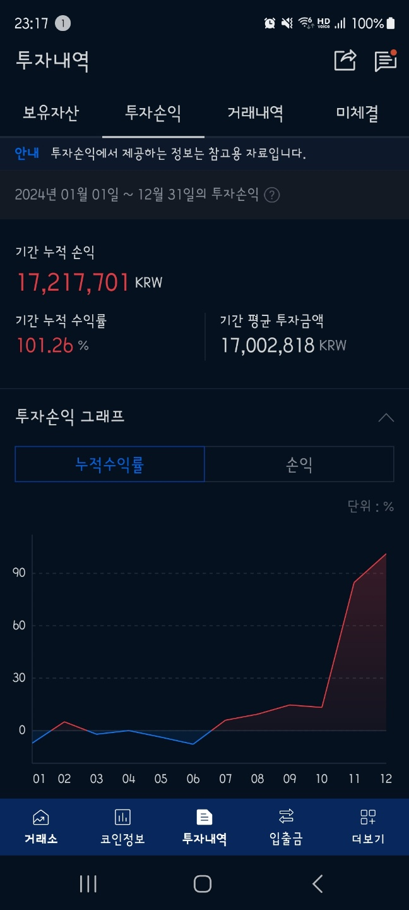

# 📈 자동매매 전략 시스템 개발 및 실전 운용

## 🔗 GitHub: [github.com/11e3/bot](https://github.com/11e3/bot)

## 🧠 프로젝트 개요

- **목표**: 주식과 암호화폐 시장에 래리 윌리엄스의 변동성 돌파 전략을 적용하여 백테스트 및 실전 자동매매 시스템을 구축  
- **기간**: 2024년 1월 ~ 현재  
- **개발/운용자**: 1인 단독 개발 및 실전 운용  
- **성과**: 1년간 1,700만 원 → 3,600만 원 (CAGR 100%)

## 🧪 전략 개요 및 설계 배경

- 변동성 돌파 전략 (Larry Williams 기반)
- 이평선 필터 추가 (SMA → EMA로 개선)
- 시장 강세/약세를 이평 기준으로 판단 후 전략 전환

### 시장 및 자산별 전략

- **주식 (국내 ETF)**: 코스닥150레버리지 ↔ 인버스 전략 교차 운용
- **암호화폐 (업비트)**: 리플(XRP)에 특화된 변동성 돌파 전략

### 기술적 조정 및 튜닝

- 상승장: 레버리지 / 하락장: 인버스
- 코인: 전일 양봉/음봉에 따라 타겟 민감도 조정
- -5% 손절 트리거 추가 (윤석열 계엄령 사건 대응)
- SMA → EMA 변경 (성과 소폭 개선)

## ⚙ 시스템 구현 및 기술 스택

- **언어**: Python  
- **라이브러리**: `requests`, `beautifulsoup4`, `numpy`, `pandas`, `matplotlib`, `pyupbit`  
- **운용 환경**: AWS EC2 nano 인스턴스에서 무한루프 방식으로 자동 실행  
- **데이터 소스**: 한국투자증권 Open API, 업비트 API  

### ETF 전략 vs 벤치마크 (2016~2025)

- CAGR: 237.8%  
- MDD: -10.3%  

### 리플 전략 vs 홀딩 (2017~2025)

- 전략: CAGR 187.0%, MDD -20.8%  
- 홀딩: CAGR 43.5%, MDD -95.9%

## 📊 실전 수익률

- **2024년 실운용 성과**:
  - 초기 자산: 약 1,700만 원  
  - 연말 기준: 약 3,600만 원  
  - CAGR: 약 100%

- **기록된 주요 이벤트**:
  - 트럼프 전략자산 발언 → 리플 집중 투자로 수익 급증
  - 윤석열 계엄 → 손절 조건 추가로 리스크 관리

## 🔮 향후 개선 방향

- 시드 증가로 인한 슬리피지 대응: 분산 투자 설계 예정  
- 전략 전환 자동화 로직 설계 예정  
- 시각화 및 백테스트 리포트 자동 생성 도구 도입 예정

## 📚 참고 자료

- 전략 출처: [systrader79 - 변동성 돌파의 원리](https://stock79.tistory.com/entry/%EB%B3%80%EB%8F%99%EC%84%B1-%EB%8F%8C%ED%8C%8C%EC%9D%98-%EC%9B%90%EB%A6%AC-125)  
- 과거 운용 사례: 키움 Open API + 윈도우 스케줄러로 코스닥 레버리지 자동매매  
